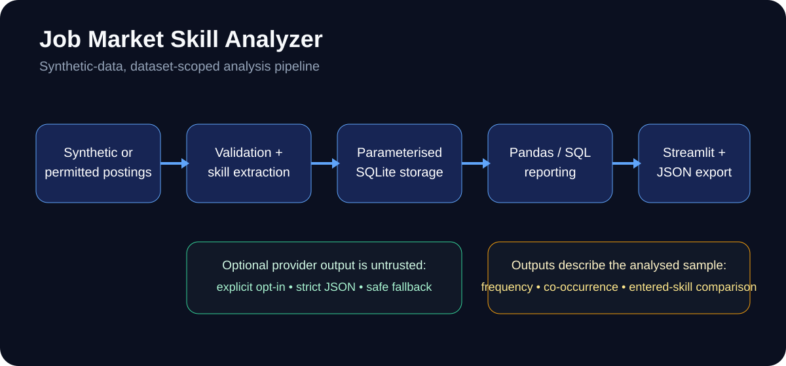

# Job Market Skill Analyzer

A reproducible Python/SQLite analytics pipeline for extracting and aggregating skills from a defined posting dataset, with deterministic no-key operation, optional constrained provider extraction and explicit data/claim boundaries.



## What the demo data means

The committed public dataset contains **40 synthetic AI/ML postings** generated by `data/generate_sample_postings.py`. It is deliberately small, synthetic and non-representative. Statistics in this repository describe only the analysed postings; they are **not** UK-wide labour-market demand, real-time market coverage, hiring probability, an ATS score or proof of candidate capability.

The sample is byte-for-byte reproducible with a fixed local RNG. Verify it with:

```bash
python data/generate_sample_postings.py --check
```

## Engineering highlights

- Deterministic no-key extraction from a curated AI/ML taxonomy.
- Boundary-aware phrase matching that avoids short-token substring errors such as `RAG` inside `storage` or `SQL` inside `NoSQL`.
- Optional OpenAI or Anthropic extraction only when `ENABLE_PROVIDER_MODE=true` **and** a provider key is present.
- Provider posting text is delimiter-escaped; provider output is strictly schema/length validated, de-duplicated and never executed.
- Parameterised SQLite storage with foreign keys and per-posting duplicate-skill protection.
- True posting counts and deterministic dataset-scoped frequency/co-occurrence calculations.
- Literal entered-skill comparison with explicit non-capability/non-hiring boundaries.
- Committed ESCO reference vocabulary with verified structure, attribution and exact-label lookup.
- Python 3.10–3.12 tests, Ruff, `pip check`, dependency auditing and non-root Docker verification in CI.

## Architecture

```text
Synthetic or permitted postings
          |
          v
Validation + curated deterministic extraction
          |
          +---- explicit optional provider ----> escaped untrusted text
          |                                      bounded JSON validation
          |                                      safe fallback
          v
Parameterised SQLite storage
          |
          v
Deterministic pandas / SQL aggregation
          |
          +---- skill frequency in analysed postings
          +---- recurring skill pairs
          +---- entered-skill comparison
          v
JSON export + Streamlit dashboard
```

See [`docs/architecture.md`](docs/architecture.md) for the detailed trust and data boundaries.

## ESCO: what it does and does not do

The repository ships `data/esco-vocabulary.json.gz`, a generated ESCO reference artefact. The committed artefact is documented as containing 2,909 occupations, 12,549 skills and all ten ISCO-08 major groups; CI validates the artefact itself rather than rebuilding it from the live API.

`src/analyzer/esco_vocabulary.py` provides validated loading, attribution, scope information and exact surface-form lookup. Ambiguous labels can map to multiple concept URIs.

**ESCO is not the active default extractor.** `src/analyzer/extractor.py` still uses the curated AI/ML `SKILL_TAXONOMY` for deterministic matching. JR04 intentionally keeps that narrow, testable path instead of adding an unbounded matcher over the full ESCO vocabulary.

The source code is MIT licensed. The ESCO-derived artefact has a separate attribution/licensing boundary; see [`ATTRIBUTION.md`](ATTRIBUTION.md).

## Reporting semantics

For each extracted skill, `postings_mentioning` is `COUNT(DISTINCT posting_id)` and `pct_of_postings` uses the true number of rows in the `postings` table as its denominator. Duplicate mentions within one posting do not inflate frequency.

A statement such as “Python appears in 26 of 40 analysed postings” is supported by this sample. “65% of the market requires Python” is not.

The entered-skill comparison normalises literal entered labels by case/whitespace and compares them with recurring extracted sample terms above a threshold. Absence from the entered list does not prove the user lacks a skill, and the percentage is not a hiring or ATS score.

## Quick start

Requirements: Python 3.10 or later.

```bash
python -m venv .venv
source .venv/bin/activate
python -m pip install -r requirements.txt
python data/generate_sample_postings.py --check
python -m src.analyzer.pipeline
streamlit run streamlit_app/app.py
```

On Windows, activate the environment with:

```powershell
.venv\Scripts\activate
```

Open `http://localhost:8501`.

## Optional provider extraction

Deterministic rule-based extraction is the default, even if a secret happens to exist in the environment. To opt in, install one provider package and set the explicit flag plus one key:

```bash
python -m pip install "openai>=1.0,<3.0"
# or
python -m pip install "anthropic>=0.30,<1.0"

export ENABLE_PROVIDER_MODE=true
export OPENAI_API_KEY="..."
# or ANTHROPIC_API_KEY="..."
```

When enabled, the posting text is sent to the selected provider. Do not enable provider mode for confidential or restricted posting data unless that transfer is permitted. Provider failures or invalid output fall back to deterministic extraction with a generic warning.

## Verification

```bash
python -m pip install -r requirements-dev.txt
python -m pip check
python -m pytest
ruff check src streamlit_app tests data tools
pip-audit -r requirements.txt
python data/generate_sample_postings.py --check
python tools/verify_esco_artifact.py
python -m src.analyzer.pipeline
```

GitHub Actions runs the tests on Python 3.10, 3.11 and 3.12, then executes the quality/security checks and a Docker build/non-root/health smoke on the exact PR/main commit.

## Docker demo

```bash
docker build -t job-market-skill-analyzer .
docker run --rm -p 8501:8501 -e ENABLE_PROVIDER_MODE=false job-market-skill-analyzer
```

The container runs as the non-root `app` user and includes a Streamlit health check. Provider credentials must be passed at runtime and are never required for the deterministic demo.

## Safety and data policy

- Public sample postings are synthetic and reproducible.
- Use only licensed or explicitly permitted datasets.
- Provider mode is explicit and default-off.
- Provider output is untrusted, bounded and never executed.
- SQL writes are parameterised and foreign keys are enabled.
- Reports are deterministic and scoped to the analysed dataset.
- No claim is made of perfect extraction, complete market coverage or immunity from every prompt-injection technique.

See [`SECURITY.md`](SECURITY.md) and the documents under `docs/security/`.

## Known limitations

- The deterministic extractor is intentionally a curated AI/ML taxonomy, not an all-occupation ESCO matcher.
- Keyword/phrase extraction can still miss synonyms or context outside that taxonomy.
- The synthetic sample is small and is not a live job feed.
- Optional provider extraction can still be imperfect after schema validation.
- Entered skills are self-reported labels and are not independently verified.
- A production ingestion service would require licensed sources, provenance/freshness controls, deduplication, monitoring, privacy/governance and independent evaluation.

## Portfolio evidence

This project demonstrates Python, pandas, SQLite, deterministic data pipelines, taxonomy processing, explicit denominator semantics, synthetic-data governance, optional constrained LLM integration, automated testing, CI, dependency security and Docker packaging.

Presentation instructions and evidence-safe wording are in [`docs/PORTFOLIO_PRESENTATION_GUIDE.md`](docs/PORTFOLIO_PRESENTATION_GUIDE.md).

## Licence

MIT for source code. The bundled ESCO-derived data artefact has separate attribution/licensing terms; see [`ATTRIBUTION.md`](ATTRIBUTION.md).

## Author

Built by [Meet Tala](https://github.com/Meettala).
